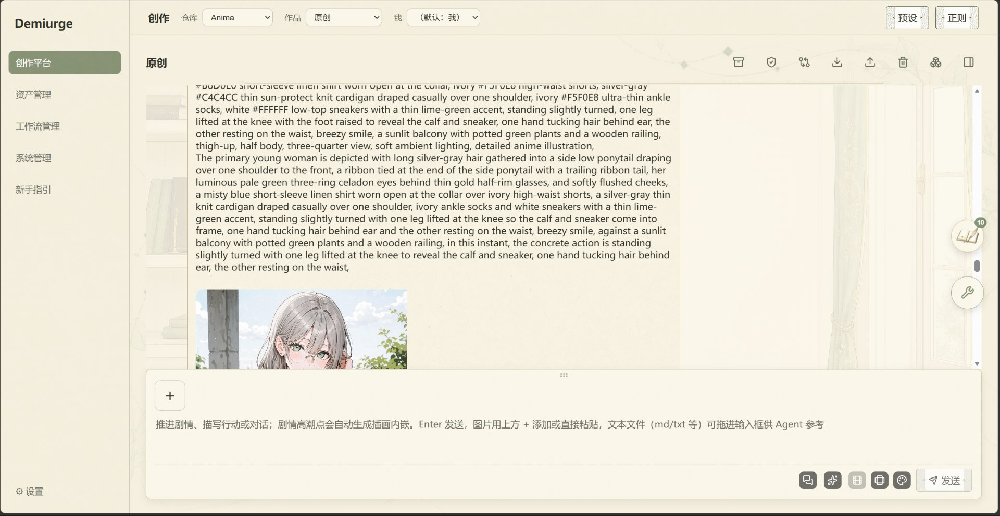
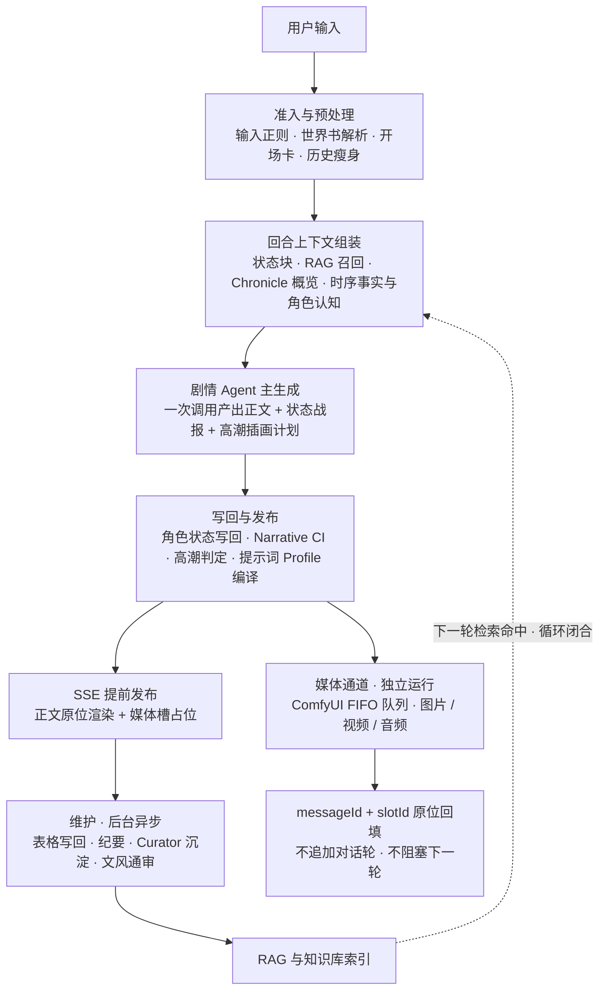

<div align="center">

# Demiurge

> 本地优先的多智能体交互叙事与 ComfyUI 创作工作台
> 剧情对话 · 角色/世界书 · 自动图文音 · 画布创作 · AI 搭工作流

[](https://www.python.org/)
[](https://react.dev/)
[](https://fastapi.tiangolo.com/)
[](https://github.com/comfyanonymous/ComfyUI)
[](https://platform.openai.com/docs/api-reference)
[](#数据与安全边界)

Demiurge 把剧情对话、角色卡、世界书、RAG 记忆、状态表、自动插画/视频/音频、
工作流搭建、画布创作与本地工具放进一个**只跑在本机**的 Web 工作台。

[快速开始](#快速开始) · [新手指南](#内置新手指南) · [教程](docs/tutorials/README.md) · [核心能力](#核心能力) · [完整剧情链路](#剧情如何运行一次回合的完整链路) · [架构](#架构) · [源码开发](#源码开发) · [数据与安全边界](#数据与安全边界)

</div>

---

## 界面预览



> 创作平台默认页——顶部选择 Anima 等提示词 Profile，剧情高潮点自动生成插画**原位回填**在对话中，
> 输入框可直接发送附件或文本文件供 Agent 参考。完整链路见
> [剧情如何运行：一次回合的完整链路](#剧情如何运行一次回合的完整链路)。

## 快速开始

在 [GitHub Releases](https://github.com/Carmenangle/Demiurge/releases) 下载名称包含
`00-USER-DOWNLOAD` 的、与你平台匹配的 **Full RAG** 包（已内置 Python 运行时、
后端、构建后的前端与本地 RAG 依赖，无需另装 Python / Node.js）。

| 平台 | 启动 | 关闭 |
|------|------|------|
| Windows x64 | `start-dev.bat` | `stop-dev.bat` |
| macOS ARM64 | `Start-Demiurge.command` | 关闭启动终端或停止对应进程 |
| Linux x64 | `start-demiurge.sh` | 关闭启动终端或停止对应进程 |

**四步跑到第一张图**（完整图文步骤见[教程 01 · 快速开始](docs/tutorials/01-quick-start.md)）：

1. 解压并启动，浏览器打开 `http://127.0.0.1:8010`。
2. 「⚙ 设置 → 模型」添加对话模型（必配）；生图/视频/嵌入模型按需添加，点「测试模型」确认连通。
3. 「⚙ 设置 → 路径」填 ComfyUI 目录与仓库文件夹——保存后下次启动会**自动拉起 ComfyUI**。
4. 「工作流管理 → 工作流模板」导入一个工作流，回到对话输入 `/w` 选择它、按节点顺序填参提交，
   生成中的媒体槽占位、完成后**原位回填**。

> ComfyUI、模型/LoRA 权重、Embedding/Reranker 权重与用户素材不随包分发，
> 需要在本机对应目录放置或在设置中选择。只用云端生图模型可不装 ComfyUI。

## 内置新手指南

应用内置可交互的**新手引导**（首次进入展示，之后可随时重新打开），覆盖：

- **快速开始**：10 步从启动、配模型/路径到运转第一个工作流模板。
- **剧情扮演**：绑定角色卡与世界书、剧情对话、多元数据面板。
- **画布创作**：在画布上把生成内容铺开编排。
- **AI 搭工作流**：从自然语言目标到可运行模板。
- **多功能工具**：GIF/精灵图、调色盘、文本工具等。

引导正文支持跳到**教学文档**（应用内直接阅读，例如[工作流模板导入详解](docs/guide/workflow-template-import.md)），
也支持跨章节跳转与锚点定位。

## 核心能力

### 剧情与记忆

- **多智能体剧情链**：剧情主模型、检索、状态维护、条目整理和后台任务按职责协作；
  正文生成与维护事务分离，维护不占对话正文字数。
- **NPC 能动性**：角色按目标、关系、场景约束与最近事件**主动行动**，失败也写成未遂或受挫。
- **结构化状态表**：全局状态、角色信息、技能、背包、任务、事件、纪要与后续选项按各自规则更新；
  正文中的 `<status>` 战报随回合写回角色状态。
- **本地 RAG**：Chroma + BM25 + Embedding + 可选 Reranker，按当前角色和场景召回相关前情；
  Curator 把值得长期保留的新知识沉淀进世界书与知识库。
- **回合快照**：每个完成回合保存不可变全状态副本，支持分支与反事实实验；已删消息不会复活。

### 角色、世界书与编辑模式

- 一个作品可绑定多张角色卡与世界书，并指定开场角色卡；世界书快照按小仓库隔离。
- 支持导入与转换 **SillyTavern** 角色卡、世界书、预设与正则，并在编辑模式中直接编辑保存。
- 顶部工作模式三选一：**剧情模式 / 多元数据生成 / 编辑模式**（角色卡、作品脚本与排错）。
- 对话支持附件（图片/文件随正文发送），生成结果与附件在读写链路上端到端一致。

### 多模态生成（图片 / 视频 / 音频）

- **多元数据面板**：按剧情高潮点自动生成图片/视频/音频，勾选即可；生成与对话并行，
  媒体完成后按 `messageId + slotId` **原位回填**，不追加对话轮、不阻塞前台。
- **图片**：提示词链从剧情事实、唯一视觉高潮、主体层级、色彩材质与光影因果展开；
  支持 Anima / Krea2 / Niji / GPT Image 等提示词 Profile 与二次采样、智能画幅。
- **视频**：图片分区底图作首帧；**首尾帧模式**把剧情首帧+尾帧连同本段对白合成剧情影片；
  「智能模态」在动作剧烈时自动切换视频、静态画面仍出图。
- **音频**：IndexTTS 系语音合成，台词按角色筛分逐角色合成，参考音轨启用音色克隆，旁白不配音。
- **LoRA 三档**：无 / 单（角色 LoRA + 兜底风格）/ 多（风格固定叠加全部在场角色），
  实际加载以提交 Trace 与 ComfyUI 工作流为准。

### 画布创作与 AI 搭工作流

- **画布创作模式**：对话与画布一键切换；从对话内容实时投影出剧情节点、工具卡与媒体节点，
  在画布上自由编排；工作流模板节点以**多节点同标签页**卡片展示，卡框与下方视图共享同一画布。
- **AI 搭工作流**：描述目标与素材，AI 规划节点、端口与参数，预检后按你确认的方案搭建并
  提交真实 ComfyUI 工作流（依托节点知识库的 Embedding + Reranker 检索）。
- **节点生态**：从 ComfyUI 同步节点索引，识别缺失节点、从插件市场安装与更新；
  `/w` 快速唤起已保存模板，按暴露顺序逐项填参。

### 工具与系统

- **资产库**：生成图片、素材与媒体统一管理，支持语义搜索与图片详情。
- **多功能工具**：GIF↔精灵图互转、调色盘、分辨率缩放、文本清理/拼接/加料/统计/转义/简繁切换。
- **模型与下载**：对话/生图/视频/嵌入模型卡管理（支持本地 GGUF 与 local 嵌入模式）、
  CivitAI/Hugging Face 等下载入口与进度显示、代理配置。
- **系统管理**：节点管理、ComfyUI 状态与自动拉起、后台活动持续运行，切换页面不中断。

## 剧情如何运行：一次回合的完整链路

一次剧情回合不是「问一句答一句」，而是 **正文生成、多模态生成、记忆维护三条通道并行**、
并被一条 **RAG 记忆循环** 闭合的完整事务。全景如下：



### 分阶段看这条链路

| # | 阶段 | 发生了什么 | 你能看到 |
|---|------|-----------|---------|
| 1 | **准入与预处理** | 输入先过正则；世界书按关键词命中并解析；多卡作品按「本轮输入直接角色名 / 世界书命中 key」判定出场角色；历史瘦身到只保留**上一次剧情轮的正文** | 正文回复带上预设/角色卡风格；世界书条目被触发 |
| 2 | **上下文组装（RAG 循环入口）** | 拼入：角色状态块（紧凑 kv + 内联证据）、RAG 知识库与检索表行、Chronicle 纪要 Top-10 概览、时序事实与角色认知（900-token 预算内）、ST 预设 marker 与思维链、输出纪律 | 角色记得此前剧情细节；事实性矛盾减少 |
| 3 | **主生成** | 一次 LLM 调用产出 `<content>` 正文，并搭车输出隐藏块：`<status>` 显示快照、`<状态更新>` JSON、`<illustration>` 高潮插画计划（锚点/主体/视觉事实/构图/画幅）、可选 `<audio>` 台词；正文额度=预设 max_tokens，另 +4000 隐藏预算，隐藏块不挤占正文 | 正文旁的绿框「在场/所在」战报；截断自动自愈续写 |
| 4 | **写回与发布** | 剥离控制块 → 角色状态写回 → Narrative CI 非阻断诊断 → 高潮判定（有插画计划 / 剧情高潮 / 主角失手 / 新角色登场等任一即命中）→ Profile 编译（同轮成稿→独立链→本地兜底）→ 组装媒体请求 → **SSE 先发布正文与媒体槽**，不等维护 | 正文先出来；媒体槽在对话中占位并开始运转 |
| 5 | **媒体通道（并行）** | 前端把媒体请求提交给本地 ComfyUI FIFO：图片按 `actors` 选 LoRA 与底图、注入精确触发词（无/单/多 LoRA 三态）；视频用图片分区底图作首帧、按高潮点/首尾帧模式带对白合成；音频按台词逐角色走 IndexTTS 音色克隆 | 生成中占位 → 完成后原位替换成图/视频/音频；切页面任务照跑 |
| 6 | **维护与记忆循环（后台）** | 表格维护用独立 LLM 把本轮变化写回 `tables.json`；每 3 回合沉淀一条 Chronicle 纪要；Curator 把「值得长期留存的新知识」**只增**写进 RAG、并受控增改当前世界书快照（不删除）；文风通审进入诊断流 | 数据表/状态表/纪要卡自动更新；**下一轮第 2 步检索立刻命中本回合沉淀的新知识** |

关键设计：正文与媒体请求在维护完成前就已发布，Agent 随即释放对话槽——表格、纪要与
条目维护在**后台异步**进行，不占正文字数、不拖慢下一轮；未完成的媒体由 ComfyUI FIFO
队列串行处理，不会作为下一轮模型输入。想看每一环的真实输入输出与报错，可查
「后台活动」面板、提交 Trace 与 ComfyUI 节点状态。

> 面向原理的完整展开（含隐藏块 JSON 字段、高潮判定条件、LoRA 三态与数据落盘位置）见
> [教程 03 · 一次剧情回合的完整链路](docs/tutorials/03-turn-full-pipeline.md)。
> 角色对话、剧情高潮、LoRA 元数据与维护事务的职责边界见 [ARCHITECTURE.md](ARCHITECTURE.md) 与
> [CONTEXT.md](CONTEXT.md)。

## 架构

| 层 | 技术与职责 |
|----|------------|
| 前端 | React + TypeScript + Vite；组件展示、`lib` 逻辑、SSE 事件归约，重测试 |
| API | FastAPI；路由保持轻量，业务逻辑下沉 `services`，import-linter 强制依赖方向 |
| Agent | LangGraph + OpenAI 兼容接口；剧情、编辑、AI 搭工作流与维护编排 |
| RAG | Chroma + BM25 + SentenceTransformers（+ 可选 Reranker）；本地检索与重排 |
| 媒体 | 独立 ComfyUI 进程；工作流提交、节点索引、图片/视频/音频结果回填 |
| 存储 | 本地仓库（大仓库/小仓库）、回合快照、角色/世界书数据与运行索引 |

更详细的模块属主、依赖方向与架构合同见 [ARCHITECTURE.md](ARCHITECTURE.md)；
中文分册技术手册（实现细节与回归门禁）与[教程](docs/tutorials/README.md)互补。

## 源码开发

### 环境

- Windows（主）/ macOS / Linux；Python `3.13`；Node.js `22`；独立安装的 ComfyUI。

### 启动

```powershell
git clone https://github.com/Carmenangle/Demiurge.git
cd Demiurge

py -3.13 -m venv backend\.venv
backend\.venv\Scripts\python.exe -m pip install -r backend\requirements-dev.txt

cd frontend
npm ci
cd ..

start-dev.bat
```

源码开发模式打开 `http://127.0.0.1:5173`；停止时运行 `stop-dev.bat`。

### 质量门禁

```powershell
backend\.venv\Scripts\python.exe -m pytest -q backend\tests
backend\.venv\Scripts\python.exe -m ruff check backend\app
cd frontend
npm test
npm run build
cd ..
backend\.venv\Scripts\python.exe scripts\release_preflight.py
git diff --check
```

## 数据与安全边界

Demiurge 默认只监听本机回环地址。不要在没有鉴权和网络隔离的情况下暴露到公网。

以下内容只保存在本机，不进入源码仓库或 Release：

- API Key、代理配置和本机设置
- 角色卡、世界书、会话、作品仓库和生成图片
- RAG 数据库、索引、日志与后台任务状态
- ComfyUI、Checkpoint、LoRA、VAE、Embedding/Reranker 权重
- 用户导入的第三方预设与私有提示词

发布包只包含运行程序与依赖。第三方模型、角色卡、预设与素材遵循各自许可证。

## 发布结构

- 终端用户只发布 Full RAG Edition；Runtime 按 Base / Application / RAG 三层生成 SHA-256 清单。
- GitHub 单资产过大时按 1.9 GB 分片并提供合并脚本。
- Windows x64、macOS ARM64 与 Linux x64 由独立矩阵构建，并执行冻结 Runtime 自检。

## 反馈与贡献

- **使用问题**：先看应用内「新手引导」与 [docs/tutorials/](docs/tutorials/README.md)；
  问题复现、功能建议与兼容性反馈提交到 [GitHub Issues](https://github.com/Carmenangle/Demiurge/issues)。
- **代码贡献**：提交前运行完整质量门禁；避免提交用户数据、模型权重、密钥或生成产物。
- 应用内技术实现细节与回归清单见 `docs/tech-manual/`（内部文档，不进远端）。

## 许可证

当前仓库尚未选择开源许可证。源码公开不代表自动授予复制、修改或再分发权；
明确许可证发布前，请保留作者权利并遵守第三方依赖与素材的许可证。

---

<div align="center">

**Demiurge** — 让剧情、角色、记忆与多模态生成在同一个本地系统中协作。

</div>
