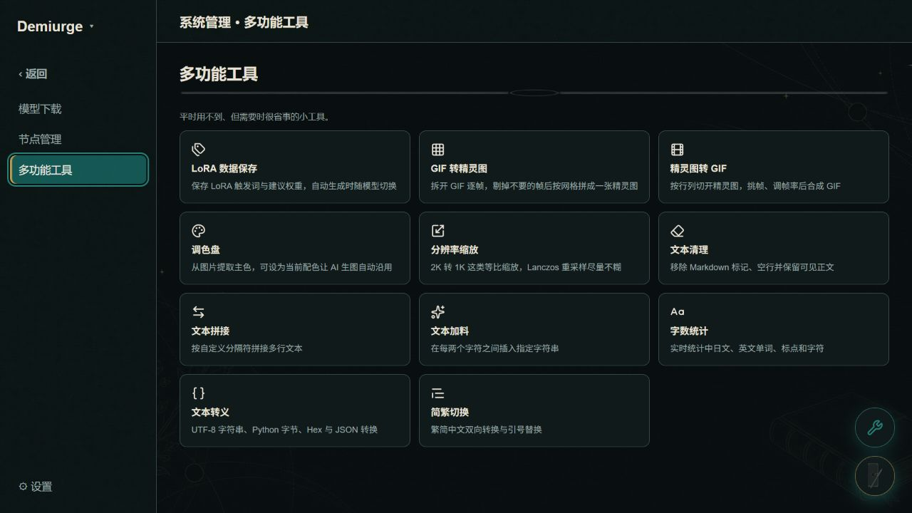
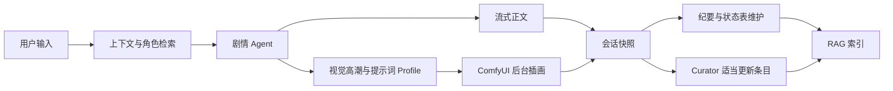

<div align="center">

# Demiurge

> 本地优先的多智能体剧情创作、角色资料与 ComfyUI 工作流工作台

[](https://github.com/Carmenangle/Demiurge/releases)
[](https://www.python.org/)
[](https://react.dev/)
[](https://github.com/comfyanonymous/ComfyUI)
[](https://platform.openai.com/docs/api-reference)
[](#数据与安全边界)

Demiurge 将剧情对话、角色卡、世界书、RAG 记忆、状态表、自动插画、工作流搭建、模型与节点管理放进一个本地 Web 工作台。

[下载](#下载与启动) · [功能](#核心能力) · [运行流程](#剧情运行流程) · [架构](#架构) · [开发](#源码开发)

</div>

---

## 工作台预览



界面提供剧情、资产、工作流和系统管理四个工作域；后台活动与快捷工具可以在页面间持续工作。

## 核心能力

### 剧情与记忆

- **多智能体剧情链**：剧情主模型、检索、状态维护、条目整理和后台任务按职责协作。
- **本地 RAG**：结合 Chroma、BM25、Embedding 与可选 Reranker，按当前角色和场景召回相关前情。
- **结构化状态表**：全局状态、角色信息、技能、背包、任务、事件、纪要和后续选项按各自更新规则维护。
- **NPC 能动性**：根据角色目标、关系、场景约束和最近事件生成主动行动，而不是只回应用户。
- **后台持久化**：会话快照是历史真源，生成、插画和维护任务可在切换页面后继续执行。

### 角色、世界书与编辑模式

- 一个作品可绑定多张角色卡与世界书，并指定开场角色卡。
- 角色描述按当前出场角色选择性注入；头像和表情可随剧情情绪切换。
- 支持 Demiurge 角色卡、世界书、预设、正则和脚本的编辑与保存。
- 可辅助导入并转换 SillyTavern 角色卡、世界书、预设与正则。
- 世界书快照按小仓库隔离，条目更新不会污染其他作品。

### 自动插画与 ComfyUI

- 剧情生成与插画任务并行运行，任一任务完成不必等待另一方。
- 插画按 `messageId + slotId` 回填到对应剧情段落，不追加新的对话轮。
- 提示词链从剧情事实、唯一视觉高潮、主体层级、色彩材质和光影因果展开。
- 支持 Anima、Krea2、Niji、GPT Image 等不同提示词 Profile，以及正面/负面提示词分流。
- LoRA 数据可保存触发词、建议权重和作者建议提示词，并按当前选中 LoRA 融合。
- 支持二次采样结果选择、智能画幅判断和按最长边换算 Latent 尺寸。

### 工作流与本地工具

- ComfyUI 节点知识库、插件市场、更新、缺失节点识别与安装进度。
- AI 辅助搭建和排错工作流，支持模板参数注入与真实工作流提交。
- CivitAI、CivArchive、Hugging Face 和链接下载入口，显示任务进度与速度。
- LoRA 数据、GIF/精灵图转换、调色盘、分辨率缩放和常用文本处理工具。

## 下载与启动

在 [GitHub Releases](https://github.com/Carmenangle/Demiurge/releases) 下载名称包含 `00-USER-DOWNLOAD` 的对应平台 Full RAG 包。

| 平台 | 启动 | 关闭 |
|------|------|------|
| Windows x64 | `start-dev.bat` | `stop-dev.bat` |
| macOS ARM64 | `Start-Demiurge.command` | 关闭启动终端或停止对应进程 |
| Linux x64 | `start-demiurge.sh` | 关闭启动终端或停止对应进程 |

终端用户包已经包含 Python Runtime、后端、构建后的前端、Chroma/BM25、Torch、Transformers 与 SentenceTransformers，不需要另装 Python、Node.js、pip 或 npm。

> ComfyUI、模型/LoRA 权重、Embedding/Reranker 权重和用户素材不会随包分发。首次使用需要在设置中选择对应目录并填写模型接口。

### Windows 快速开始

1. 解压 `Windows-x64-Full-RAG` 压缩包。
2. 双击 `start-dev.bat`，等待浏览器打开 `http://127.0.0.1:8010`。
3. 在设置中配置 OpenAI 兼容接口、ComfyUI 目录、仓库文件夹和 RAG 模型目录。
4. 退出时双击 `stop-dev.bat`；脚本只终止当前便携包记录且路径匹配的 Runtime 进程。

## 剧情运行流程



正文输出、自动插画和后台维护分离：正文不会因为图片生成而阻塞，表格与条目更新也不会占用对话正文的 token 或暴露在聊天气泡中。

## 架构

| 层 | 技术与职责 |
|----|------------|
| 前端 | React + TypeScript + Vite；负责展示、交互和 SSE 事件归约 |
| API | FastAPI；路由保持轻量，业务逻辑下沉到 `services` |
| Agent | LangGraph + OpenAI 兼容接口；负责剧情、编辑、工作流和维护编排 |
| RAG | Chroma + BM25 + SentenceTransformers；负责本地检索与重排 |
| 图像 | 独立 ComfyUI 进程与 HTTP/WebSocket 接缝；负责工作流提交和结果回填 |
| 存储 | 本地仓库、会话快照、角色/世界书数据和运行索引 |

更详细的模块属主、依赖方向和架构合同见 [ARCHITECTURE.md](ARCHITECTURE.md)。

## 源码开发

### 环境

- Windows
- Python `3.13`
- Node.js `22`
- 独立安装的 ComfyUI

### 启动

```powershell
git clone https://github.com/Carmenangle/Demiurge.git
cd Demiurge

py -3.13 -m venv backend\.venv
backend\.venv\Scripts\python.exe -m pip install -r backend\requirements-dev.txt

cd frontend
npm ci
cd ..

start-dev.bat
```

源码开发模式打开 `http://127.0.0.1:5173`；停止时运行 `stop-dev.bat`。

### 质量门禁

```powershell
backend\.venv\Scripts\python.exe -m pytest -q backend\tests
backend\.venv\Scripts\python.exe -m ruff check backend\app
cd frontend
npm test
npm run build
cd ..
backend\.venv\Scripts\python.exe scripts\release_preflight.py
git diff --check
```

## 数据与安全边界

Demiurge 默认只监听本机回环地址。不要在没有鉴权和网络隔离的情况下暴露到公网。

以下内容只保存在本机，不进入源码仓库或 Runtime Release：

- API Key、代理配置和本机设置
- 角色卡、世界书、会话、作品仓库和生成图片
- RAG 数据库、索引、日志与后台任务状态
- ComfyUI、Checkpoint、LoRA、VAE、Embedding/Reranker 权重
- 用户导入的第三方预设和私有提示词

发布包只包含运行程序和依赖。第三方模型、角色卡、预设与素材继续遵循各自许可证。

## 发布结构

- 终端用户只发布 Full RAG Edition。
- Runtime 按 Base / Application / RAG 三层生成 SHA-256 清单。
- GitHub 单资产过大时按 1.9 GB 分片，并提供合并脚本。
- Windows、macOS ARM64 与 Linux x64 由独立矩阵构建并执行冻结 Runtime 自检。

## 反馈与贡献

问题复现、功能建议和兼容性反馈可提交到 [GitHub Issues](https://github.com/Carmenangle/Demiurge/issues)。提交代码前请运行完整质量门禁，并避免提交用户数据、模型权重、密钥或生成产物。

## 许可证

当前仓库尚未选择开源许可证。源码公开不代表自动授予复制、修改或再分发权；明确许可证发布前，请保留作者权利并遵守第三方依赖与素材的许可证。

---

<div align="center">

**Demiurge** — 让剧情、记忆、角色与图像工作流在同一个本地系统中协作。

</div>
