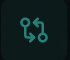
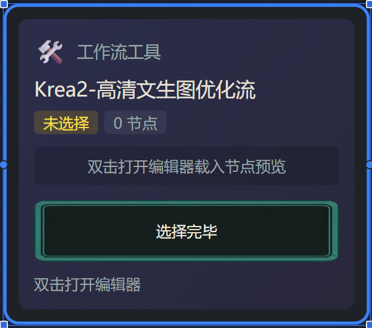

# 画布创作：图文教程

> 把生成内容铺在画布上编排。先跑通[快速开始](./quick-start.md)再进画布更顺。
>
> 本篇是应用内新手引导「画布创作」板块的 GitHub 阅读版。

## 1. 进入画布（模式选项）

顶部工作模式三选一：剧情模式（推进剧情，高潮点自动生成并内嵌）、多元数据生成（调试格式模版的试验台）、编辑模式（角色卡、作品脚本与排错）。进入作品后点功能栏的对话/画布切换按钮（⇄ 图标）即可进入画布视图，所有模式都可以在对话/画布间切换。

## 2. 画布里照常对话

画布视图的对话框与对话模式完全同源：同一发送链路，普通消息、/w 选模板、灵感卡插入都可用。输入栏默认折叠为悬浮小球（把空间留给画布），点小球展开，再点左下角按钮收起。

## 3. 工作流模板节点

对话里输入「/w」选定模板后，画布自动投影出「工作流工具」节点：未确认时逐节点显示迷你 ComfyUI 画布预览（超过 8 个只显示前 8 个）；双击节点打开编辑器填参数或 AI 编排，点「选择完毕」锁定参数，封面徽标同步显示已选节点数；点「运转工作流」提交 ComfyUI 后台运转，「生成中」占位节点完成后被生成内容节点原位替换。

## 下一步

- 模板怎么进画布、怎么选暴露参数 → 回到[快速开始](./quick-start.md)第 5–10 步。
- 用自然语言让 AI 从零搭工作流 → [AI 搭工作流](./workflow.md)。
