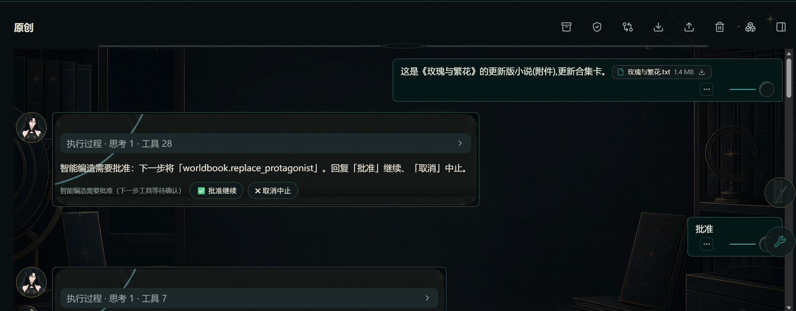
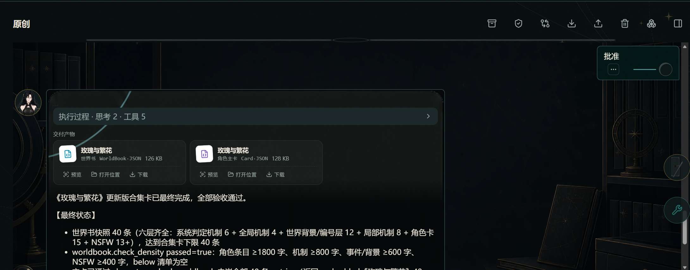
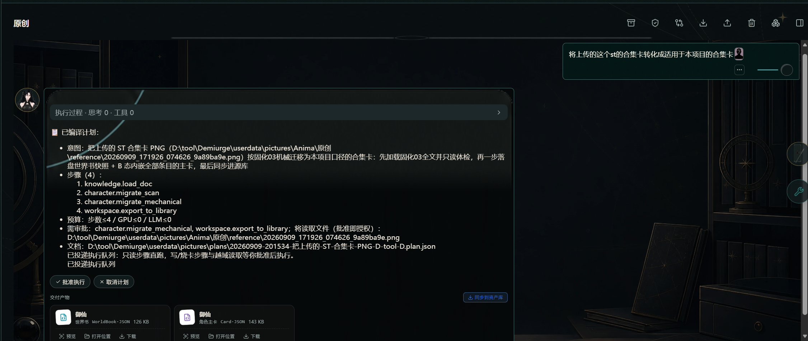

# 固化流程

> 应用内新手引导「固化流程」板块的 GitHub 阅读版，三条固化链路合订：
> **01 批量生图 / 02 小说转合集卡 / 03 合集卡转化（ST 卡）**。
> 都靠「智能编造 + 固化知识库」跑通——固化知识决定 Agent 怎么想，固化预设决定 Agent 怎么快跑；
> 与[快速开始](./quick-start.md)「导入工作流」配套：先跑通工作流，再让同类任务变成一次性自动跑完的预设。

## 01：批量生图

### 1. 让智能编造跑批量生图

在「智能编造」对话里，用大白话讲清楚「按哪份文档、分几批、跑哪个模板」。Agent 会自己拼出计划：读取文档 → `workflow.read_exposed_fields` → `workflow.submit_batch` 批提交 → `media.collect_comfy_outputs` 回收产物，配额与步骤数都已按文档规模算好（steps=3、GPU≤14、LLM≤0）。确认没问题点「批准执行」，Agent 就把整批送进队列。

要点：

- 「意图」写得越具体越好——把文档路径、模板、LoRA、套数一起交代，Agent 会按字面照办。
- 计划里出现 `workflow.submit_batch` 表示要走批提交，单次提交一次性带多张提示词，节省 GPU 调度。
- 计划出现「离审批」时点「批准执行」即可，CPU 配额与域校验仍然照常生效。

### 2. 产物原位回填并自动固化为预设

批提交运转完成后，全部图按顺序原位回填到对话里：每张图卡片都有「查看原图 / 下载 / 重新生图 / 蒙化修改 / 发送至对话 / 设为封面」动作。整个批量任务的步骤轨迹会自动固化成一条「草稿」配方——在对话里点「保留」（或在「⚙ 设置 → 智能体 → 固化流程预设」里点保留）后列入清单；之后对话里出现同类目标，Agent 优先整条重放，省去逐步探索的 token。durable / expensive 步骤照常走审批与配额。

要点：

- 草稿配方只在「保留」后才进入固化流程清单；不点保留的草稿不影响下次对话。
- 「⚙ 设置 → 智能体」面板里有两块互相独立：**固化流程预设**（配方清单，跑通后产生）与**固化知识库**（`data/agent_knowledge/` 下的流程规范，每次会话都会强制注入）。本节示例里的「按 14 套装 + Krea2 + QRQ LoRA 批量生图」之所以是 Agent 默认行为，正是因为《固化01-批量生图规范》已通过固化知识库常驻注入。
- 配方草稿只在「完整跑通」时产生；中途取消或失败不会留下可保留的草稿。

## 02：小说转合集卡

### 1. 提供小说，一句话说清要什么

在「智能编造」对话里把小说原文粘进输入框，或直接把 `.md` / `.txt` 拖进去（给文件路径也可以）。

然后用一句话说清目标——**从头创建合集卡**、或**更新已有的合集卡**都可以：

- 「这是《XX》小说，做成合集卡」
- 「这是《XX》的更新版小说，更新已有合集卡」

不需要你指定工具、路径或流程：Agent 会自动按章节感知阅读、切素材、先列条目清单给你确认，再逐批写条目。

### 2. 一路批准，拿到产物

接下来只需在弹审批时点「批准执行」（durable 步骤逐个确认）。条目数不足 40、密度不达标（角色条目 ≥1800 / 机制 ≥800 / 编号 ≥600 / NSFW ≥400 字）会自动继续补写，中断也会自动续跑——不用反复催。

完成后对话给出汇总（条目总数 / 达标 / 豁免 / 密度验收），消息下方就是**交付产物卡**（主卡 + 世界书：可预览 / 打开位置 / 下载）。要进资产库点「**同步到资产库**」即可（旧版自动备份）；每次完成自动存一版**版本快照**，可回档。

### 3. 产物去哪了

产物默认留在作品内（卡目录三文件：`card.json` + `worldbook.json` + `regex.json`）；进资产库后可在「资产管理」随时取用。想反向核查条目质量，去「⚙ 设置 → 智能体 → 固化知识库」对照《固化02-小说转合集卡规范》（§1 字符与目录形态、§3.3 keys 质量），看完回来直接对 AI 说「按 §3.3 重写条目 7 的 keys」即可。

## 03：合集卡转化（ST 卡）

### 1. 把 ST 卡交给智能编造，一步拿到合集卡

把 ST 的 PNG / JSON 卡拖进「智能编造」对话，说一句「把这份 ST 卡转成作品内能用的合集卡」就行——不用指定工具、路径或流程。

Agent 先跑 `character.migrate_scan` 体检（逐条列出 ST 注入位字段、渲染宏、好感度表格、空 keys 等待转写点），再用 `character.migrate_mechanical` 一步机械转写——零 LLM、不让模型逐条改写：

1. 删掉 ST 注入位字段，条目只留 `content` / `comment` / `keys` / `constant` / `enabled` 五字段；
2. 渲染宏转纯文本标记（`<status>`→【状态栏】、`<roll>`→【检定】、`<encounter>`→【登场】、`<fate>`→【命定预警】）；
3. 好感度表格转【好感度 ≤-30 / 区间】档位文本；
4. `keys` 空则补、超 6 裁短；`entries` 统一 list。

转完立刻做无损验证：对源正文重放同一套规则逐字比对，一致才算过——**原卡设定一个字都不会丢**。

### 2. 落盘与产物卡

落盘是卡目录三文件：`card.json`（B 态，内嵌全部条目）、`worldbook.json`（运行时真源）、`regex.json`（原卡正则原样保留），完成后自动存一版版本快照，可回档。

点「批准执行」后，计划卡下方直接出现**交付产物卡**（角色主卡 + 世界书：可预览 / 打开位置 / 下载），不用去翻执行面板；计划任务是异步跑的，完成后这条消息会自动补上产物卡，刷新也还在。产物默认留在作品内，要进资产库（独立世界书）点产物卡右侧的「**同步到资产库**」即可（旧版自动备份）。
