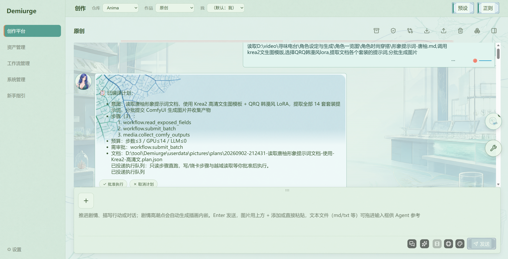
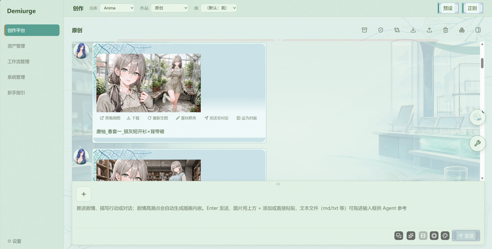

# 固化流程：批量生图（智能编造）

> 智能编造 Agent 跑批量生图，并把整套流程固化为可重放的预设。
> 与[快速开始](./quick-start.md)「导入工作流」配套：跑通工作流之后，用本篇把同类任务变成一次性自动跑完的预设。

本篇是应用内新手引导「固化流程」板块的 GitHub 阅读版，图与步骤一一对应。

## 1. 让智能编造跑批量生图

在「智能编造」对话里，用大白话讲清楚「按哪份文档、分几批、跑哪个模板」。Agent 会自己拼出计划：读取文档 → `workflow.read_exposed_fields` → `workflow.submit_batch` 批提交 → `media.collect_comfy_outputs` 回收产物，配额与步骤数都已按文档规模算好（steps=3、GPU≤14、LLM≤0）。确认没问题点「批准执行」，Agent 就把整批送进队列。

要点：

- 「意图」写得越具体越好——把文档路径、模板、LoRA、套数一起交代，Agent 会按字面照办。
- 计划里出现 `workflow.submit_batch` 表示要走批提交，单次提交一次性带多张提示词，节省 GPU 调度。
- 计划出现「离审批」时点「批准执行」即可，CPU 配额与域校验仍然照常生效。

## 2. 产物原位回填并自动固化为预设

批提交运转完成后，14 张图按顺序原位回填到对话里：每张图卡片都有「查看原图 / 下载 / 重新生图 / 蒙化修改 / 发送至对话 / 设为封面」动作。整个批量任务的步骤轨迹会自动固化成一条「草稿」配方——在对话里点「保留」（或在「⚙ 设置 → 智能体 → 固化流程预设」里点保留）后列入清单；之后对话里出现同类目标，Agent 优先整条重放，省去逐步探索的 token。durable / expensive 步骤照常走审批与配额。

要点：

- 草稿配方只在「保留」后才进入固化流程清单；不点保留的草稿不影响下次对话。
- 「⚙ 设置 → 智能体」面板里有两块互相独立：**固化流程预设**（配方清单，跑通后产生）与**固化知识库**（`data/agent_knowledge/` 下的流程规范，每次会话都会强制注入）。本节示例里的「按 14 套装 + Krea2 + QRQ LoRA 批量生图」之所以是 Agent 默认行为，正是因为《固化01-批量生图规范》已通过固化知识库常驻注入——固化知识决定 Agent 怎么想，固化预设决定 Agent 怎么快跑。
- 配方草稿只在「完整跑通」时产生；中途取消或失败不会留下可保留的草稿。