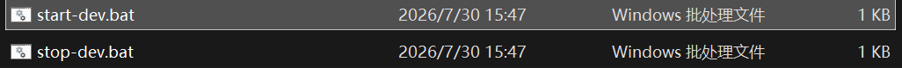
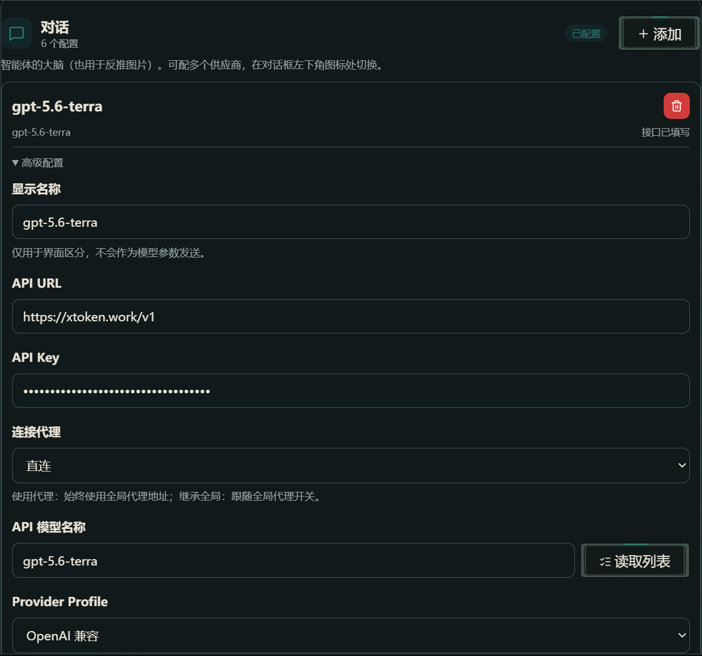
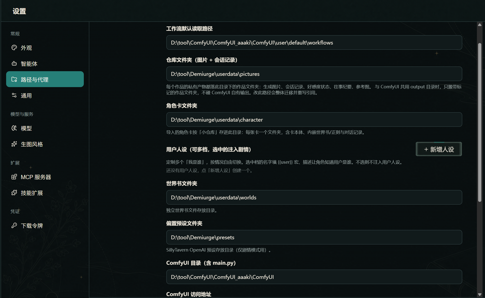
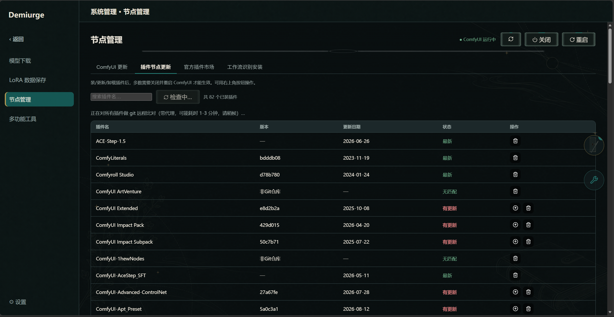
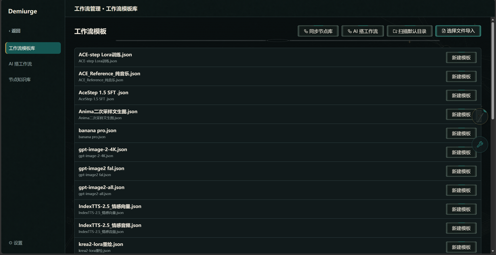
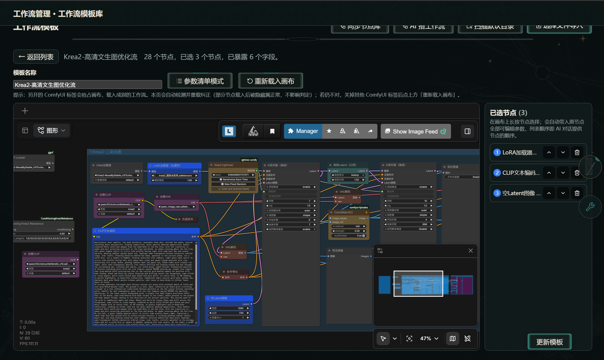
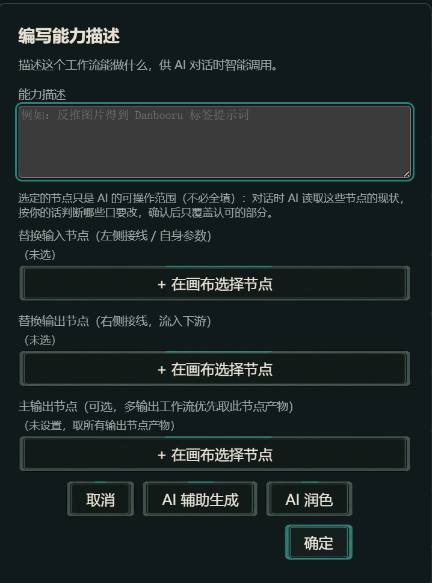
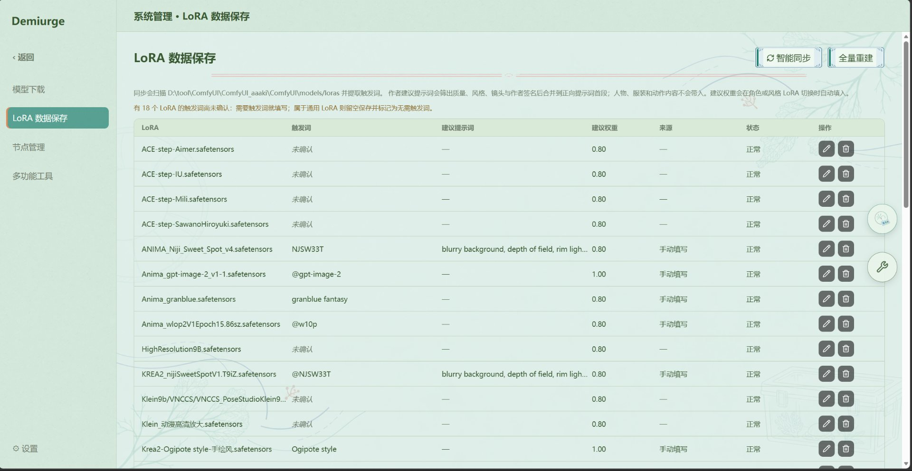
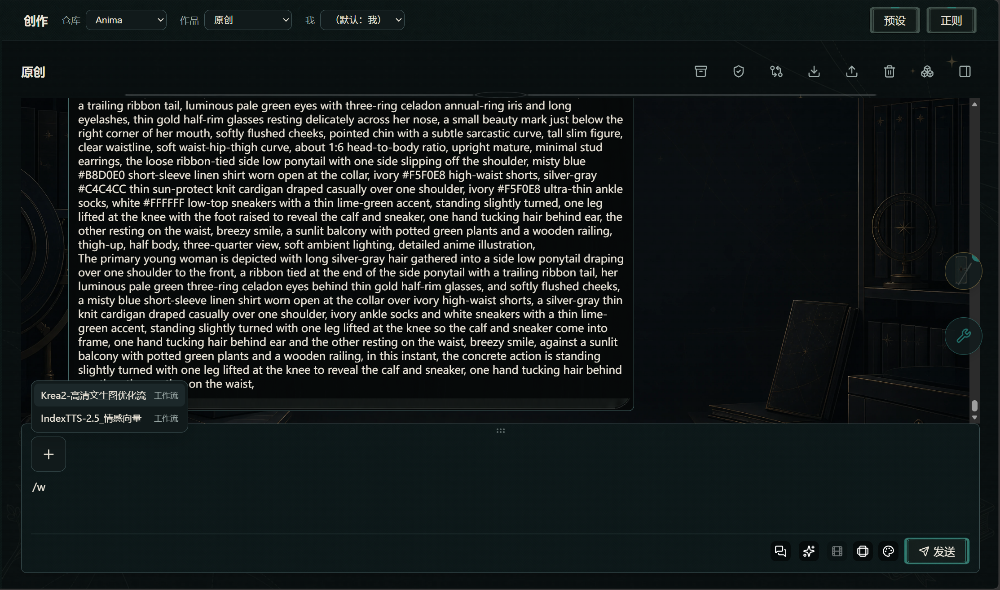
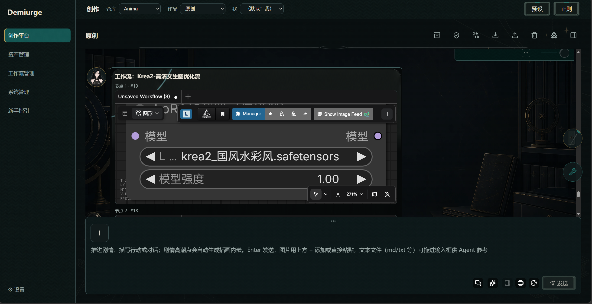

# 快速开始：11 步图文教程

> 面向终端用户的完整图文版快速开始。README 只保留最短四步指引，本篇展开每步的界面位置、操作细节与常见坑。
>
> 与「应用内新手引导」的关系：启动应用后首次进入会展示这套引导，也可随时在「设置」重新打开。本页是同一份内容的 GitHub 阅读版，方便未运行应用的读者/贡献者查看。

---

## 1. 启动应用

开发环境双击 `start-dev.bat`，便携版运行包内启动脚本。浏览器打开 http://127.0.0.1:8010（开发环境 Vite 端口 5173）。

---

## 2. 配置模型（设置 → 模型）

在「⚙ 设置 → 模型」添加模型卡：填 API URL（如 https://api.openai.com/v1）、API Key、API 模型名称（可点「读取模型列表」直接选择）；按接口协议选 Provider Profile（OpenAI 兼容 / Claude 兼容，按协议选、不按模型名选），最后点「测试模型」确认连通。

对话模型必配；生图、视频、嵌入模型按需分别添加（本地嵌入/GGUF 也可在对应卡片切 local 模式）。

---

## 3. 配置路径（设置 → 路径）

「⚙ 设置 → 路径」：填 ComfyUI 目录（含 main.py）与 ComfyUI 访问地址；再设仓库文件夹（生成图片与会话记录都落这里）、角色卡文件夹、世界书文件夹、偏置预设文件夹、工作流默认读取路径。目录决定素材从哪读、产物存到哪。

---

## 4. ComfyUI 自动启动

「⚙ 设置 → 路径」里填好 ComfyUI 目录（含 main.py）与 ComfyUI 访问地址并保存后，start-dev 启动时会按保存的配置自动拉起 ComfyUI，无需手动启动（已在运行则自动跳过）。首次初始化较慢（约 30–60 秒），可在「系统管理 → 节点管理」查看状态，● 运行中 即可。

两个例外需要手动：刚填完路径还没重启过后端、或自动拉起失败时，在「节点管理」右上角点「启动」手动拉起。只用云端生图模型可跳过本步（不填 ComfyUI 目录就不会自动启动）。

---

## 5. 导入工作流模板

「工作流管理 → 工作流模板」：点「选择文件导入」单个导入，或「扫描默认目录」批量导入。

导入之后怎么选暴露参数、怎么填能力描述并保存，见 [导入工作流模板详解](./workflow-template-import.md)。

---

## 6. 选择暴露的节点参数

解析后进入模板编辑，两种方式选暴露参数：

- **参数清单模式**：勾选要暴露的参数（常暴露提示词、宽高、LoRA、图片输入口；已连线字段不可暴露），系统自动推断语义绑定（prompt / lora / latent / 负面词等）。
- **ComfyUI 界面模式（推荐）**：在内嵌画布上长按节点选择，顺序即对话填参顺序，画布载错可点「重新载入画布」。

---

## 7. 编写能力描述与保存模板

「编写能力描述」里可指定替换输入 / 输出节点（即 AI 可干涉的范围）与主输出节点（默认不选，结果不合预期时再手动指定）。填「模板名称」后点「保存模板」。

---

## 8. LoRA 数据保存（智能同步模型权重）

「系统管理 → LoRA 数据保存」自动扫描本机 ComfyUI 的 loras 目录（默认 `D:\tool\ComfyUI\ComfyUI\models\loras`），把每个 `.safetensors` 的触发词、建议提示词、建议权重、来源与作者签名提取进表格——方便工作流生成时辅助导入模型权重、自动插入触发词。

首次进入点「智能同步」建立索引（只扫描本机文件、不调用 API），之后装了新权重再点一次同步更新即可。「触发词 / 建议提示词 / 建议权重」可手动编辑并保存，未填的项会显示「未确认」。需要把整批 LoRA 删除重建时用「全量重建」（仅在索引异常时使用）。

跑工作流时若模板标注了 LoRA 字段，系统会按当前对话的角色、风格与 LoRA 列表自动挑匹配项注入参数，省去每次手动填触发词。

---

## 9. 对话输入 /w 调用模板

回到作品对话，直接输入「/w」即可弹出模板选择提示，选定要使用的模板。

还没有可用模板时，可以让 AI 从零搭一个，见 [AI 搭工作流](./workflow.md) 第 3 步。

---

## 10. 按节点顺序填参

选定模板后，按模板选择的节点顺序展示各节点暴露的参数，逐项填写提示词、宽高、LoRA、图片输入口等。

---

## 11. 运转工作流

提交后工作流在后台运转，生成中的媒体槽在对话中占位，完成后图片 / 视频 / 音频原位回填、不新增对话轮。

要让剧情高潮自动出图，可在媒体设置里把模板绑为插画 / 视频 / 音频模板。

---

## 完成后能做什么

跑完这 11 步你已经能：手动调用任意工作流模板生成图片 / 视频 / 音频，并按节点顺序填参。下一步建议：

- 想让剧情自动出图 → [教程 02 · 第一条剧情与自动插画](../tutorials/02-roleplay-and-auto-illustration.md)
- 想理解一次回合的完整链路 → [教程 03 · 一次剧情回合的完整链路](../tutorials/03-turn-full-pipeline.md)
- 想看应用内引导的其余板块 → [剧情扮演](./story.md) · [画布创作](./canvas.md) · [AI 搭工作流](./workflow.md) · [多功能工具](./tools.md)
- 反馈 / 找错误排查入口 → [教程索引](../tutorials/README.md)