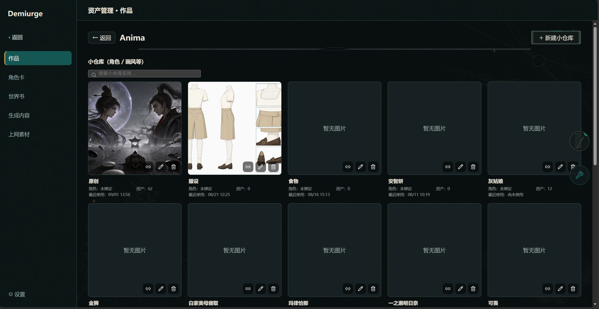
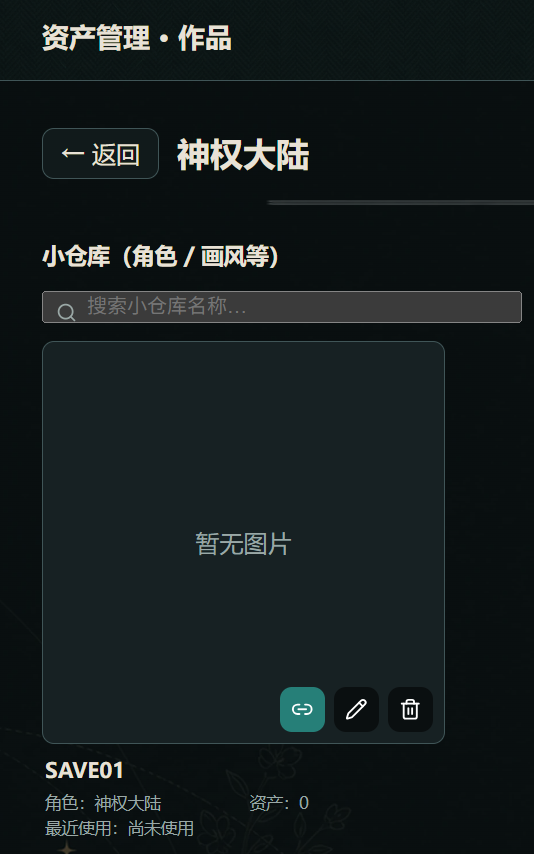
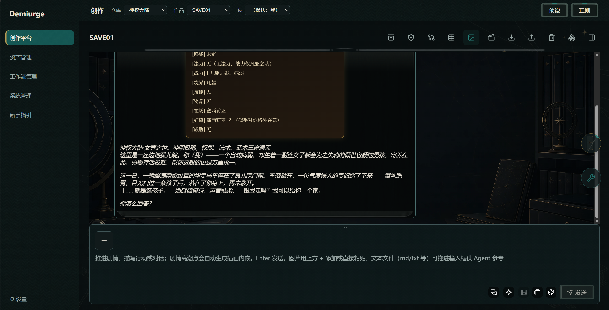
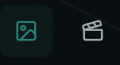
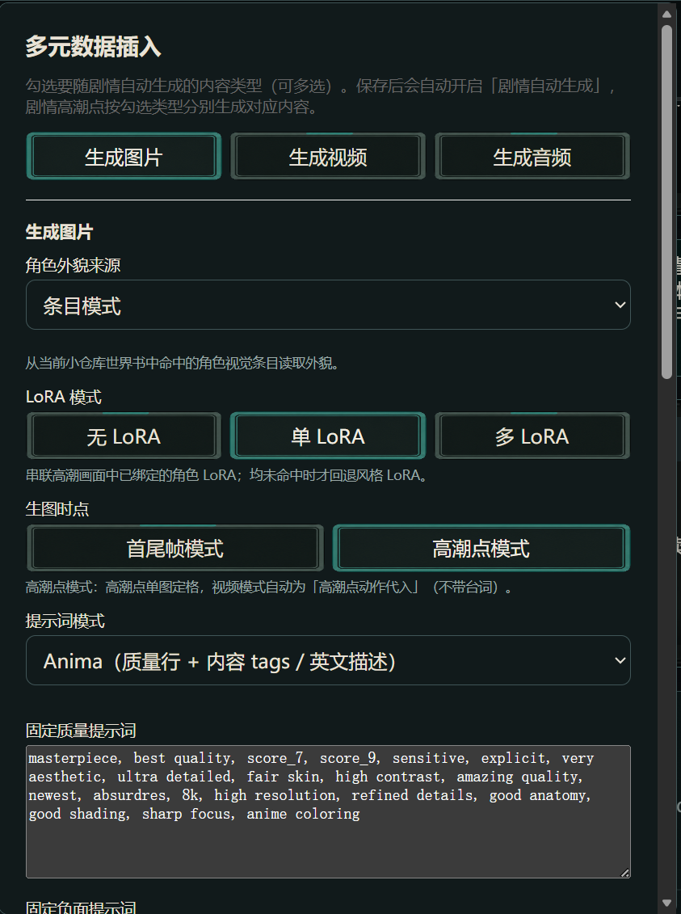

# 剧情扮演：图文教程

> 绑定角色卡与世界书，开始沉浸式剧情创作。与[快速开始](./quick-start.md)配套：跑通第一张图之后，用本篇进入剧情模式。
>
> 本篇是应用内新手引导「剧情扮演」板块的 GitHub 阅读版，图与步骤一一对应。

## 1. 创建作品并绑定角色卡

首页集中了仓库、角色卡、世界书入口；点击左上角就能新建仓库和小仓库，其中新建小仓库（作品）时会弹出「仓库绑定」：选择角色卡即可（卡内嵌世界书导入时已外拆为同名独立世界书，绑卡后自动加载）；也可从首页「角色卡」入口卡或资产管理一键建作品。

## 2. 挂世界书与偏置预设（可选）

每个仓库下方都有三个按键：最左侧用于绑定角色卡和世界书（打开「仓库绑定」弹窗），中间是编辑仓库名称，右侧是删除按钮。在「仓库绑定」弹窗里：独立世界书可另挂别的书（不绑则自动用与卡同名的世界书）；偏置预设选本作品专属预设，留空则用全局激活预设。ST 格式预设从首页「预设」入口卡导入：片段可开关、可拖动排序，越靠后越接近生成点、遵守越强。

## 3. 开始剧情对话

绑定成功后进入对话界面，刚进入就会有初始对话，直接输入即可继续（开场卡决定第一句）。剧情模式默认启用：只带上一次剧情轮的正文作为历史；角色会自主行动，尝试失败也会写成未遂或受挫，而不是静默消失。上方功能栏的功能变多了，就说明世界书与角色卡导入成功。

## 4. 角色状态与回合维护

正文中模型会输出 `<status>` 绿框战报（在场、所在等），系统随回合写回角色状态，并自动维护表格与纪要；值得长期保留的新知识由 Curator 沉淀进世界书与知识库。对话上方功能栏第 5 个开关控制是否开启剧情生成多元数据，第 6 个是其中的具体参数调整按钮。

## 5. 多元数据插入面板

点对话上方功能栏的「多元数据插入」按钮打开面板：最上方是生成图片 / 生成视频 / 生成音频三个开关，支持多选（至少勾选一项）。保存预设会自动开启「剧情自动生成」，剧情高潮点按勾选类型分别生成。注意视频没有独立素材来源：它用图片分区里每个角色的底图作首帧，所以想出视频要先配好图片分区。

### 角色外貌来源二选一

- **条目模式**：合集卡（主要角色写在世界书条目中）——从当前小仓库世界书命中的角色视觉条目读取外貌。
- **角色卡模式**：多角色卡 + 一本世界书的玩法——从本作品绑定的角色卡描述读取外貌，适合纯机制世界书。

### LoRA 模式三档

- **无 LoRA**：只用角色底图，不加载角色或风格 LoRA，此时提交的工作流模板也不需要标注 LoRA 字段。
- **单 LoRA**：为每个角色绑定一个 LoRA，生成时自动添加 LoRA 节点完成多人物生成（支持多角色多 LoRA），某个角色没有专属 LoRA 就落到「兜底风格 LoRA」。
- **多 LoRA**：角色要 LoRA、风格也要 LoRA 的情况，固定加载默认风格 LoRA 并叠加全部在场角色 LoRA。

### 提示词模式看生图模型是谁

- 用 ComfyUI 本地生成建议选 **Anima**（质量行 + 内容 tags / 英文描述），可固定质量提示词与负面提示词。
- 用 GPT Image、Banana 之类 API 生图选**自然语言**。
- 用 Niji 出图就选 **Niji**（主体 / 风格 / 附加 / 后缀）。

### 生图时机二选一

- **高潮点模式**：出单张定格图。
- **首尾帧模式**：按剧情首帧 + 尾帧生成、全程覆盖剧情与对白（此时视频自动变为首尾帧剧情影片，含本段全部对白）。

### 工作流模板的节点标注要求

- **图片模板**：必须标注「提示词」字段，否则无法注入剧情提示词、保存不了；建议再标注——负面提示词（用固定负面时才参与）、Latent 宽度与高度（不标则 1K / 2K / 4K 尺寸不注入）、LoRA 字段（单 / 多 LoRA 模式必须，否则角色 LoRA 不生效）、角色底图槽位（图生图锁定角色一致性，纯文生图可不标）。
- **视频模板**：没有额外必标字段，每名角色的参考图自动取图片分区该角色的底图作首帧；勾「智能模态」后，剧情动作剧烈（奔跑、律动）时自动改用视频模板，静态画面仍出图。
- **音频模板**（IndexTTS 系语音合成）：必须标注「角色台词」（voice_text），否则无法注入台词、保存不了；建议再标注「参考音轨」（voice_reference）启用音色克隆——每个角色准备一条参考音轨，台词按角色筛分逐角色合成，旁白 / 叙述句不配音。

### 按角色配置

按角色配置区逐行填：角色名（与剧情中一致）+ 角色 LoRA 与权重 + 底图（用于角色一致性）。若某角色既无 LoRA 也无底图且无兜底风格，面板会红字提示该角色出图缺少一致性锚点。

## 下一步

- 想让自动插画按剧情高潮原位回填 → 看[教程 02 · 第一条剧情与自动插画](../tutorials/02-roleplay-and-auto-illustration.md)展开讲每个参数。
- 把生成内容铺到画布上编排 → [画布创作](./canvas.md)。
