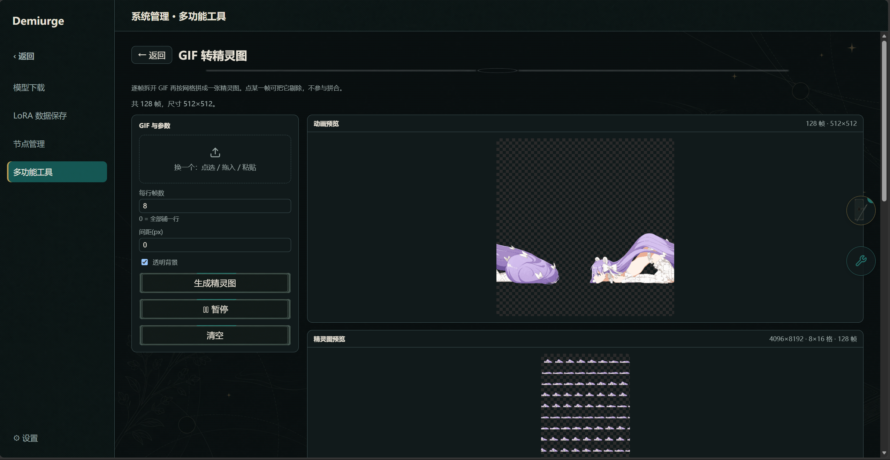
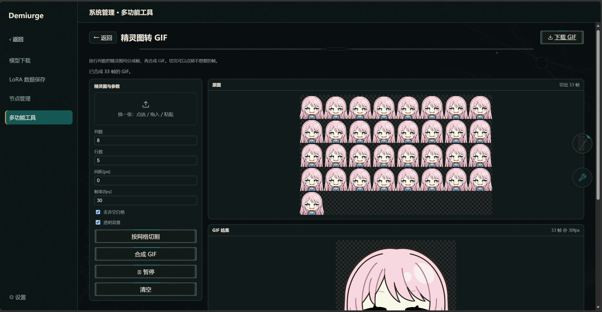
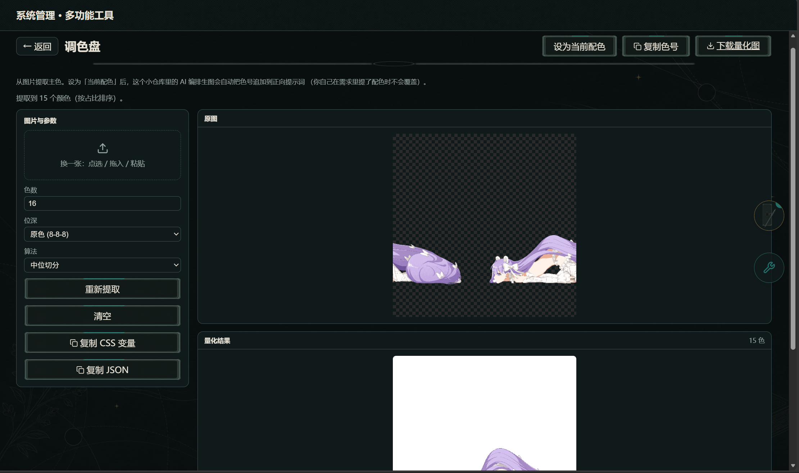
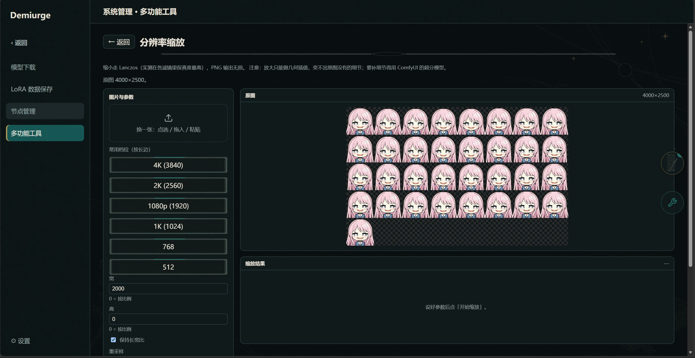
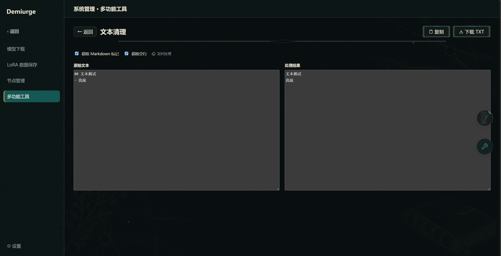
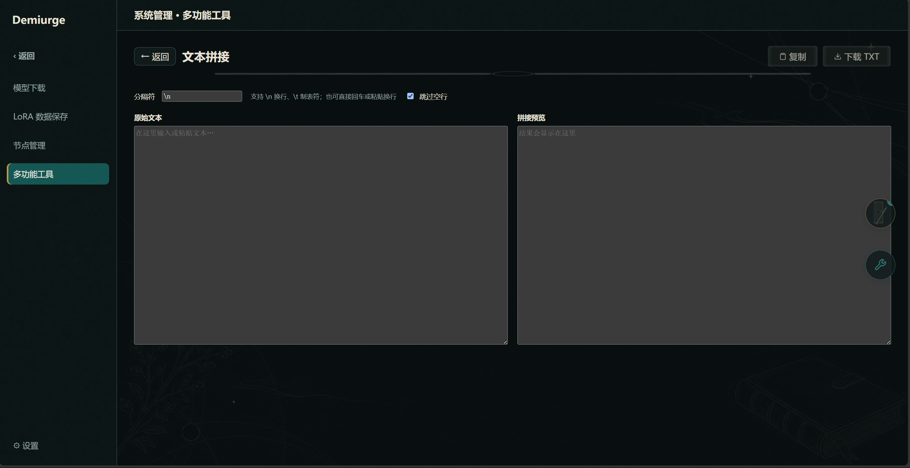
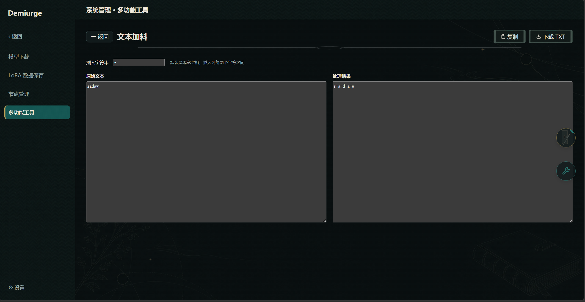
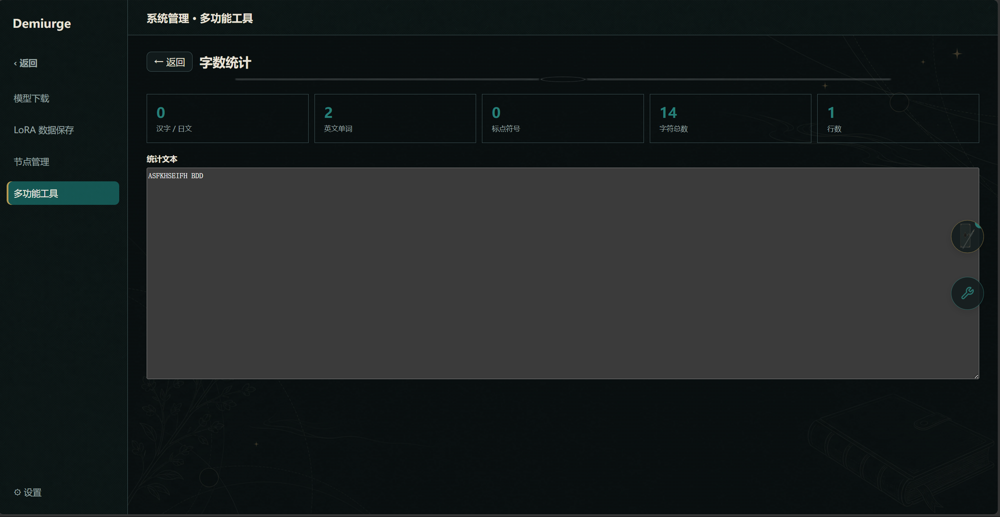
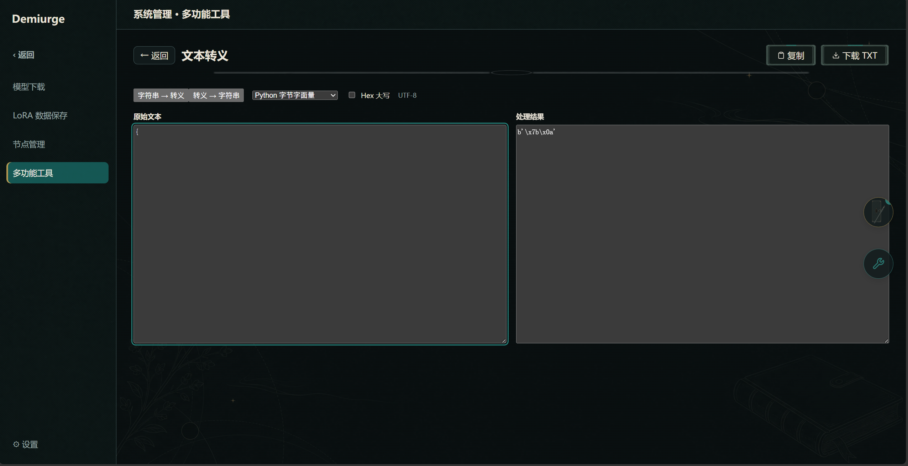
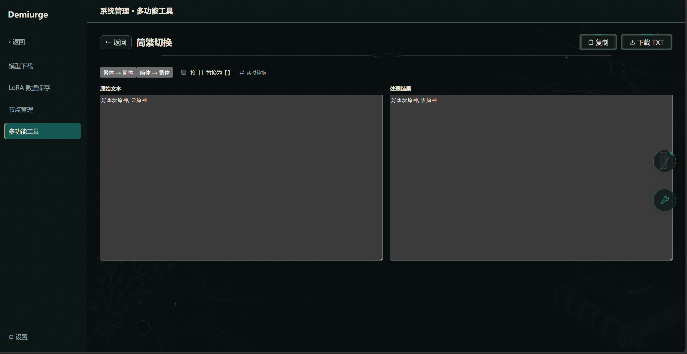

# 多功能工具：图文教程

> 入口在「系统管理 → 多功能工具」：十个小工具逐个说明——GIF 与精灵图互转、调色盘、分辨率缩放、文本处理全家桶。
>
> 本篇是应用内新手引导「多功能工具」板块的 GitHub 阅读版。

## 1. GIF 转精灵图

拆开 GIF 逐帧，剔掉不要的帧后按网格拼成一张精灵图——做表情包、逐帧立绘素材时用，帧剔除与动画预览即时生效。

## 2. 精灵图转 GIF

按行列切开精灵图，挑帧、调帧率后合成 GIF——和「GIF 转精灵图」互为反向工具，精灵图与动图随取随换。

## 3. 调色盘

从图片提取主色，可一键设为当前配色，让 AI 生图自动沿用这套色调——想固定作品整体画风时很好用。

## 4. 分辨率缩放

2K 转 1K 这类等比缩放，Lanczos 重采样尽量不糊；档位按长边给、短边按原图比例自动算，不会把图拉变形。

## 5. 文本清理

移除 Markdown 标记、空行并保留可见正文——从别处复制来的带格式文本，清洗后再进提示词或正文。

## 6. 文本拼接

按自定义分隔符拼接多行文本——把一堆触发词、标签合并成一行时用。

## 7. 文本加料

在每两个字符之间插入指定字符串——比如逐字插换行、加分隔符做特殊排版。

## 8. 字数统计

实时统计中日文字数、英文单词、标点和字符——卡字数写正文、提示词时用。

## 9. 文本转义

UTF-8 字符串、Python 字节、Hex 与 JSON 互转——处理转义串、调试数据格式时用。

## 10. 简繁切换

繁简中文双向转换与引号替换——角色卡、世界书简繁体统一时用。

