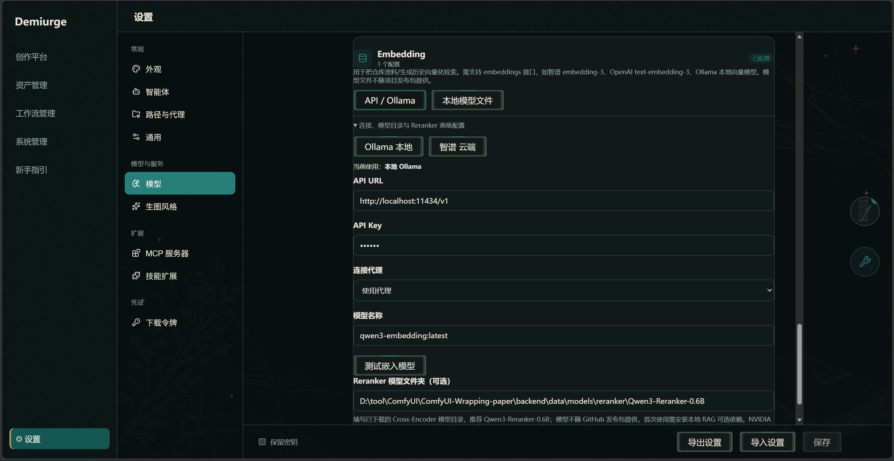
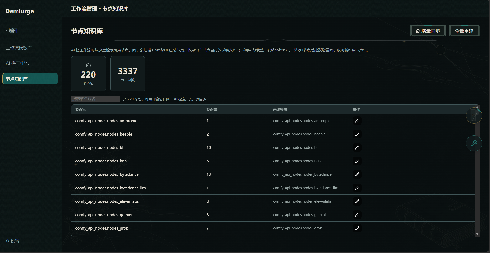
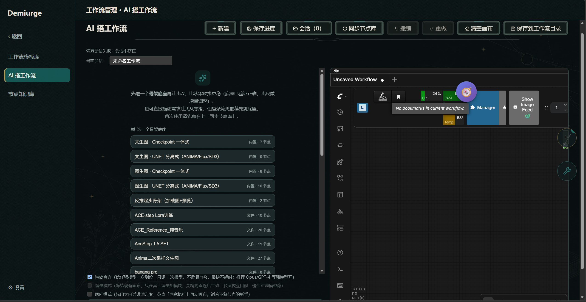
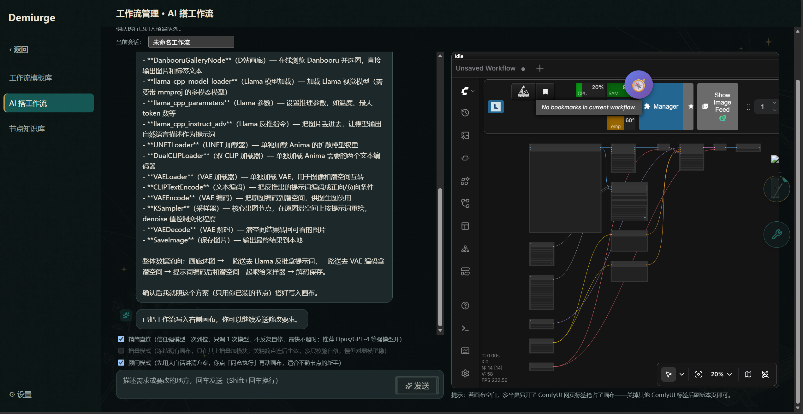

# AI 搭工作流：图文教程

> 用自然语言生成 ComfyUI 工作流——描述想要的效果，AI 检索节点知识库、给出方案并直接在画布上搭出来。
>
> 本篇是应用内新手引导「AI 搭工作流」板块的 GitHub 阅读版。

## 1. 前置：配好嵌入模型（设置 → 模型）

AI 搭工作流靠节点知识库做语义检索（RAG），检索质量取决于嵌入模型。先到「⚙ 设置 → 模型」最下方的 Embedding 区块配好嵌入模型：云端可选智谱 embedding-3、OpenAI text-embedding-3，本地可选 Ollama 的 qwen3-embedding（都有快捷预设可一键填入），填完点「测试嵌入模型」确认连通。

强烈建议配置：不配嵌入模型的话，节点知识库没有向量化能力，RAG 检索会大打折扣，AI 搭工作流时就找不到（或找错）可用节点。

## 2. 节点知识库：增量同步就行

确认「⚙ 设置 → 路径」里 ComfyUI 访问地址已填、ComfyUI 已启动，然后到「工作流管理 → 节点知识库」点「增量同步」建立节点索引：它只抓取本机已装节点自带的说明信息入库，不调用大模型、不花费 tokens；之后装 / 卸了节点，再点一次增量同步更新可用节点集即可。

别随手点「全量重建」：它会走 api_key 把全部节点包重新嵌入一遍，要花钱（云端嵌入按量计费），除非索引异常否则用不上。

## 3. AI 搭工作流：推荐这样设置

进入「工作流管理 → AI 搭工作流」，输入框用大白话描述想要的效果（搭建走「对话模型」，强模型一次到位的成功率明显更高）。推荐组合：不用先选骨架底座（选了会自动切到增量模式，那是在现有工作流上小步修改的玩法），勾上「精简直连」+「顾问模式」——精简直连信任强模型一次到位、只调 1 次模型、最快不超时；顾问模式先用大白话讲清方案，确认后再动工。两个都开，从零一步到位。

## 4. 方案确认：点「同意执行」

顾问模式下 AI 会先发一条方案消息，用大白话讲清打算用哪些节点、怎么搭（如图）。检查没问题点「同意执行」，AI 才真正动画布生成工作流；想改需求就点「编辑」在方案上直接改，改完「保存并执行」；不想要就「取消」。方案里提示缺节点时：点「去安装」装对应节点，或点「用本机平替重搭」改用你已装的同类节点重新出方案。

## 5. 最终结果与复用

执行完成后，搭好的工作流就铺在右侧 ComfyUI 画布上（如图），可以直接运转出图验证效果；想调整就继续对话描述（例如「把采样步数改成 30」），搭建进度会自动存进会话、下次进入可恢复。满意后可以把它收进「工作流管理 → 工作流模板库」（选择文件导入 / 扫描默认目录），之后对话里输入「/w」随时调用（见[快速开始](./quick-start.md)）。

## 下一步

- 想把搭好的模板绑定到剧情自动出图 → [剧情扮演](./story.md)第 5 步「多元数据插入面板」。
- 想理解 AI 搭工作流在整条生成链里的位置 → [教程 03 · 一次剧情回合的完整链路](../tutorials/03-turn-full-pipeline.md)。
