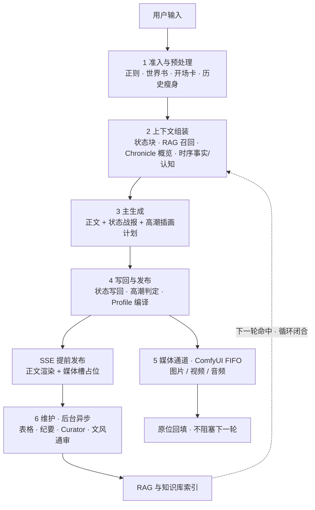

# 教程 03 · 一次剧情回合的完整链路

- **用途**：把「一次剧情回合」从输入到输出的每一步讲透——RAG 记忆循环、状态/表格写回、
  高潮提示词提取、图片 / 视频 / 音频生成与原位回填，以及每步的数据落盘与可观测入口。
  读完你可以看懂任何一次生成「为什么是这样」。
- **前置条件**：已跑通[教程 02](02-roleplay-and-auto-illustration.md)的第一条自动插画；
  本文不要求读代码。
- **一句话总览**：一次剧情回合 = **正文生成 / 多模态生成 / 记忆维护三条通道并行**，
  由一条 **RAG 记忆循环** 闭合：本轮沉淀的新知识，下一轮检索立刻命中。

---

## 0. 全景



下面按阶段展开。方括号里是它**真正写到磁盘的位置**（都在你的仓库文件夹内）。

## 1. 准入与预处理

用户输入进入回合事务前先做四件事：

1. **输入正则**：对实时输入跑正则脚本（跳过错位深度门控——深度门控只作用于历史楼层，
   不能擦掉你刚输入的内容）。
2. **世界书解析**：按关键词命中世界书条目，决定本轮注入哪几条世界知识；注入文本再跑
   `WORLD_INFO` 位正则。
3. **开场卡与出场角色判定**：空会话第一句只注入开场卡的角色描述；之后多卡作品按
   「本轮输入直接写了谁」或「命中的世界书条目指向谁」判定出场角色，都未命中才回退上一轮。
4. **历史瘦身**：剧情模式只带**上一次剧情轮**的正文进上下文，且剥掉 think/状态/插画等
   控制块——既保证连贯，又控制 token。

## 2. 上下文组装（RAG 循环入口）

主生成前，系统把以下内容按顺序拼进提示词（越靠后离生成点越近、遵守越严）：

| 内容 | 说明 |
|------|------|
| 角色状态块 | 紧凑 kv + 内联证据（在场/所在/好感度等），是权威约束 |
| RAG 召回 | 知识库检索结果 + 检索到的表行（Chroma + BM25 融合，可选 Reranker） |
| Chronicle 概览 | 纪要库 FTS5 召回 + 最近条目，按出场人物相关性排序，只注入 Top-10 短概览 |
| 时序事实与角色认知 | 本回合仍有效的客观事实 + 指定角色「知道/相信/误解」什么，900-token 预算内注入 |
| 世界书 + 预设 | 命中的世界书条目；ST 预设的 marker（卡字段/`{{lastUserMessage}}` 等）与思维链原位插入——尾部链离生成点最近，遵守最强 |
| 输出纪律 | 思考只允许三类内容、禁止复述设定、禁止预写标签块 |

**这就是记忆循环的“读”侧**：状态表、RAG、Chronicle、时序事实四路候选，
只有权威状态与有效事实是约束，Chronicle/RAG 是证据。

## 3. 主生成：一次调用，多路输出

剧情 Agent 用**一次 LLM 调用**产出正文，并“搭车”在正文后输出几个隐藏控制块
（不新增调用、不挤占正文 token——正文额度 = 预设 `max_tokens`，隐藏块另有 +4000 预算）：

- `<content>`：真正的剧情正文（流式发布、显示在对话里）。
- `<status>`：绿框显示快照（在场 / 所在等），随回合写回角色状态。
- `<状态更新>`：结构化 JSON，`character_state` 据此写回（0 额外 LLM）。
- `<illustration>`：高潮插画计划，核心字段：

```json
{
  "anchor": "高潮段末句原文（逐字来自正文，用于定位插画槽）",
  "camera": "镜头描述",
  "composition": "构图描述",
  "subjects": [{ "name": "角色精确名", "description": "英文外貌", "weight": 1.0 }],
  "visual_facts": [{ "kind": "action", "fact": "可画事实", "evidence": "逐字存在于正文" }],
  "motion": 2,
  "aspect_ratio": "2:3",
  "art_direction": { "visual_thesis": "", "hierarchy": "", "palette_material": "", "lighting_logic": "" }
}
```

  校验很严：`anchor` 必须能定位回正文、`visual_facts` 的 evidence 必须逐字存在、
  画幅必须在白名单内——模型给的任何“幻觉证据”都会被丢弃。
- `<audio>`（可选）：`{lines:[{speaker,text,emotion}]}` 台词清单，供音频通道逐角色合成。

正文生成后被截断怎么办：先“续写式”自愈（残缺输出回喂 + 断点续写指令），仍不行整段
重掷，最多三次；结构硬校验（think 未闭合 / 正文缺失等）通过才发布。

## 4. 写回与发布

生成完成后按严格顺序处理（这一步里模型不再被调用）：

1. 拆分 think 前缀，剥掉 `<transition>/<illustration>/<audio>` 控制块；
2. 抽 `<status>` 快照、剥 `<状态更新>` JSON → **角色状态写回** `state.json`；
3. **Narrative CI** 非阻断诊断：事实/时间/地点/关系/认知越权，只保存证据不自动改写；
4. **高潮判定**：有有效插画计划、剧情场景是高潮/NSFW、主角在回合中“失手”失控、
   新角色登场、或（开了自动插画却漏了计划时）兜底判定——任一命中即出图；
5. **提示词 Profile 编译**：按图像模型把「剧情高潮 + 角色稳定外貌」编译成对应格式
   （ComfyUI 本地用 Anima 的 tags/英文结构、GPT Image 用自然语言、Niji 用主体/风格分段），
   编译失败依次走同轮成稿 → 独立链 → 本地兜底；
6. 组装媒体请求（prompt / 出场角色 actors / 锚点 / scene_spec / 视频配置），
   **SSE 立即发布正文与媒体槽**——不等第 6 阶段的维护完成。

## 5. 媒体通道（与对话并行，ComfyUI FIFO）

正文发布后，媒体请求走**独立通道**：前端运行时 → `POST /comfyui/submit` →
本地 ComfyUI 原生 FIFO 队列 → 完成按 `messageId + slotId` **原位替换**对话里的占位槽。

**图片**：
- 提示词在 Profile 成稿后，机械注入每个出场角色的 **LoRA 精确触发词**与作者质量词
  （大小写不敏感去重），并按 `actors` 为每个角色选底图锁一致性；
- LoRA 三态：`无`——不加载角色/风格 LoRA，提交前把模板内 LoRA 权重归零；
  `单`——按出场顺序串联角色 LoRA，全部未命中才用风格兜底；
  `多`——固定先加载默认风格 LoRA，再叠加全部在场角色 LoRA；
- 多角色多 LoRA **不新增模型调用**：注入器复用模板标注的 LoRA 加载器为链首，
  动态复制后续加载器串联 MODEL/CLIP，把下游统一重接到链尾。

**视频**（首尾帧 / 高潮点 / 智能模态）：
- **首帧底图** = 该角色图片分区底图（本槽已完成插画 → 最近一次插画 → 手动指定 →
  模板无图像口才走文生视频），pending 的任务不会被等待；
- 高潮点模式：高潮定格窗口做动作延伸；**首尾帧模式**：从头到尾覆盖剧情、列出全部对白
  并按剧情位置标 `at_s`；转场任务用上尾帧 + 当前首帧生成过渡镜头；
- 台词由正文对白解析而来（按剧情位置对齐），不用额外 LLM 猜镜头。

**音频**（IndexTTS 语音合成）：
- 按第 3 步 `<audio>` 块的台词清单，**逐角色**提交合成，参考音轨启用音色克隆；
- 旁白 / 叙述句不配音；解析失败时从可见正文机械降级抽取台词。

## 6. 维护与记忆循环（后台异步，不阻塞对话）

正文与媒体已发布，Agent 释放对话槽后，后台继续做四件事：

| 维护 | 干什么 | 写到哪里 |
|------|--------|---------|
| 表格维护 | 独立 LLM 读「本轮用户输入 + 已生成正文」，输出 JSON 操作写回 | `tables.json`（下次组装以只读上下文注入） |
| 纪要 | 每 3 个 assistant 回合沉淀一条 overview/chronicle/dialogue/characters 纪要；概览 ≤30 字、正文 ≤300 字，超限先压缩 | `chronicle.db`（FTS5 供第 2 步召回） |
| Curator 沉淀 | 从回合窗口抽「值得长期留存的新知识」写入 RAG，并受控增改当前世界书快照 | RAG 向量库 + 小仓库世界书快照（**只增不改、不删除**） |
| 文风通审 | 按采样率做文风 LLM 判定，结果进入 Narrative CI 诊断流 | Trace 证据 |

**循环闭合**：Curator 写进 RAG / 世界书的内容，下一轮第 2 步检索就会被召回——
角色因此能“记住”几轮前确立的长期设定；状态表与纪要同理。这就是记忆循环。

## 7. 一次回合的数据落盘

| 数据 | 位置 | 一句话 |
|------|------|--------|
| 对话显示与生成历史（真源） | `<作品>/<小仓库>/chat.json` | 消息与媒体槽归属 |
| 角色动态状态 | `<小仓库>/state.json` | `<状态更新>` / `<status>` 写回 |
| 通用数据表 | `<小仓库>/tables.json` | 表格维护写回 |
| 纪要 | `<小仓库>/chronicle.db` | 每 3 回合一条 |
| 世界书快照 | `<小仓库>/worldbook.json` | 与源库隔离 |
| Agent 结构化 Trace | 运行日志 `agent-trace.jsonl` | 每步事件与输入输出 |
| 生成图片/视频/音频 | 仓库素材目录 | 由媒体通道落盘 |

## 8. 在哪看每一步

| 你想确认 | 看哪里 |
|---------|--------|
| 正文先于媒体、占位回填过程 | 对话流：正文立刻出，媒体槽“运转中”→“完成”原位替换 |
| 角色状态是否写回 | 对话绿框战报 + 角色状态表 |
| 表格/纪要是否更新 | 数据表视图与纪要卡（维护是后台的，可能比正文晚几秒） |
| 这一轮高潮到底出没出图、为什么 | 该轮提交的 Trace 与「后台活动」面板 |
| 实际加载了哪个 LoRA | 提交 Trace + ComfyUI 工作流节点（别只看提示词） |
| ComfyUI 队列与报错 | 「系统管理 → 节点管理」与 ComfyUI 界面 |

## 9. 常见疑问

- **为什么正文先出来、图后到？** 正文与媒体是两条独立通道；媒体走 ComfyUI FIFO 排队，
  设计上就不允许它阻塞对话。
- **为什么维护不影响对话速度？** 正文发布后 Agent 即释放对话槽，表格/纪要/Curator
  在后台异步跑；维护失败也不阻断正文。
- **关了「视频 / 音频」开关会省什么？** 对应通道不再编译请求与调用提取逻辑——
  零 token 干烧，正文照常。
- **图里角色不对，是不是提示词问题？** 先查 Trace 里实际加载的 LoRA 与底图，
  再查外貌来源模式（条目 / 角色卡）是否匹配你的角色卡玩法。

## 排查入口

- 界面步骤：应用内「新手引导 → 剧情扮演」。
- 更细的机制合同（隐藏块协议、高潮条件树、Profile 编译、落盘地图）见仓库
  `docs/tech-manual/`（内部文档）；架构职责边界见 `ARCHITECTURE.md`。
- 有问题到 [GitHub Issues](https://github.com/Carmenangle/Demiurge/issues) 提交，
  附上该轮 Trace 与「后台活动」截图。
